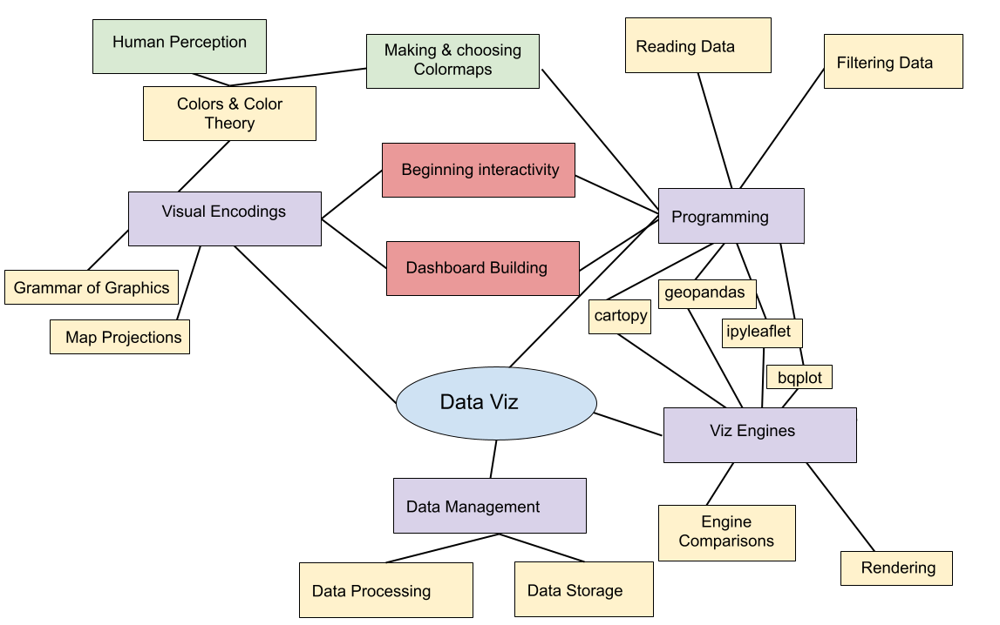
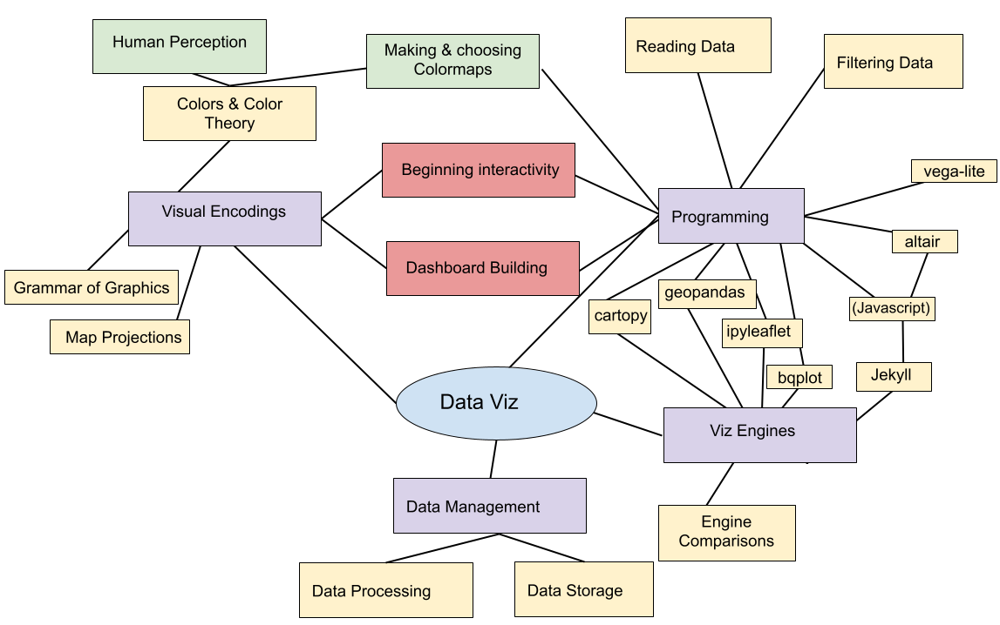
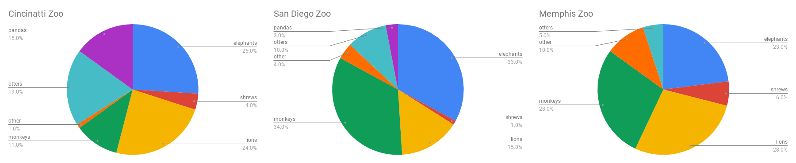
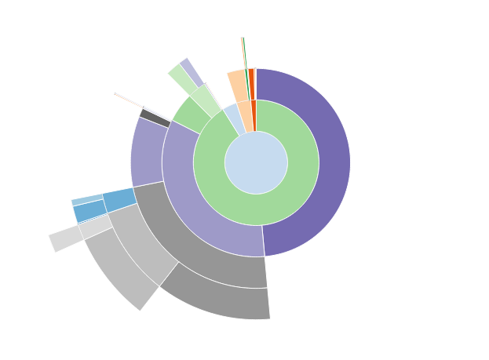
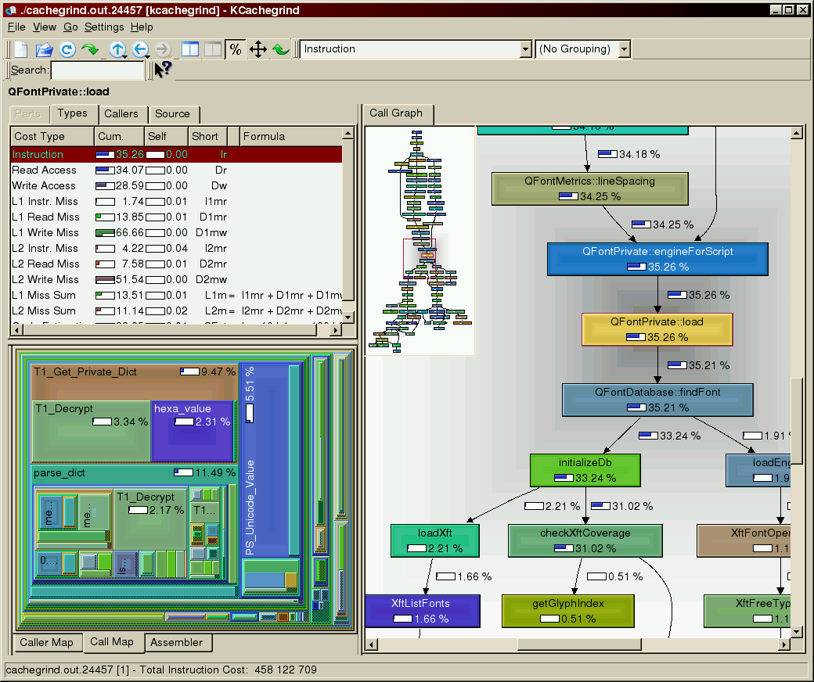

# "Temperature Taking" Quiz

notes: 
go over where this is!

---

## Last Week

notes:
last week we discussed maps and mappable data

---

## This Week

notes: 
this week we'll start working toward some tools we'll use to start hosting some interactive viz on the web.

Luckily, will all of our usage of bqplot and grammar of graphics we are well equipt to do this!

in previous iterations of the class we used online notebook hosts called Iodide or Starboard to do this, but it is no longer supported so we are going to use a different method called ~~Starboard~~ Streamlit which we'll then host on Huggingface.

I've kept some of the links to old Iodide/Starboard prep notebooks in the extended resources in case you are curious, but it will be very similar to stuff we will be doing using ~~Starboard~~ Streamlit

But first!  We'll start with Altair, and Jekyll before getting into Streamlit (though you do have a setup Lab assigned this week)

---

## Today

 1. Choosing your viz
 1. Intro to Vega/Vega-lite
 1. Intro to Vega-lite in Altair
 1. Intro to Jekyll (but probably next class)

---

 
 
 

# TOPIC 1: Choosing your viz

notes:
we've gone through a bunch of different sorts of viz, so its worth taking a moment to think about which kind to use in each instance

---

## Composition

Don't use a pie chart.

<section data-background-image="images/piechart.png" aria-label="A pie chart showing the relative amount of the level of popularity of animals in the zoo (elephants, shrews, lions, monkeys, otters, pandas, and other).  Color legend for each animal is shown at bottom of chart. From the chart, it is difficult to determine which is the most popular animal." data-background-size="95% auto">

notes:
pie charts force you to analyze things by area or angle, which are multidimensional attributes that are easy to confuse.

which is the most popular zoo animal in this pie chart? Elephants, otters, or lions?

---

## Composition

Don't use a pie chart.

<section data-background-image="images/piechartlabels.png" aria-label="A pie chart showing the relative amount of the level of popularity of animals in the zoo (elephants, shrews, lions, monkeys, otters, pandas, and other).  The percentage of ach is labeled with a line connecting the label text to position on pie chart." data-background-size="95% auto">

notes:
we can make a marginal improvement by labeling the values.

But we wouldn't be doing visualization if we were interested in just reading text.

---

## Composition

Don't use a pie chart.

<section data-background-image="images/3dpiechart.png" aria-label="A 3-dimensional pie chart showing the relative amount of the level of popularity of animals in the zoo (elephants, shrews, lions, monkeys, otters, pandas, and other).  The percentage of ach is labeled with a line connecting the label text to position on pie chart." data-background-size="95% auto">

notes:
And if 2-dimensional area is difficult to understand, then 3-dimensional volume is even worse. 

3 dimensional values violate the principle of proportional ink, which states that:

 The sizes of shaded areas in a visualization need to be proportional to the data values they represent. 

---

## Alternatives

<section data-background-image="images/donutchart.png" aria-label="A donut chart showing the relative amount of the level of popularity of animals in the zoo (elephants, shrews, lions, monkeys, otters, pandas, and other).  The percentage of ach is labeled with a line connecting the label text to position on pie chart." data-background-size="95% auto">

notes:
Some people will try to sell you on a modified version of a pie chart called a donut chart that has a hole in the middle. This is a slight improvement because it helps you see the values in the circle as 1-dimensional arc length instead of area. 

But circles are still hard to decipher.

---

## Alternatives

<section data-background-image="images/treemap.png" aria-label="A rectangular treemap chart showing the relative amount of the level of popularity of animals in the zoo (elephants, shrews, lions, monkeys, otters, pandas, and other).  Labels of each animal overlap with position of rectangle in chart." data-background-size="95% auto">

notes:
We can reduce some of the confusion associated with using circles by creating proportional *rectangular* area. Now we can compare along the dimensions of height and width for certain values.

But area is still problematic because it asks us to compare two dimensions - width and height - simultaneously.

---

## Alternatives

<section data-background-image="images/barchart.png" aria-label="A horizontal bar chart showing the relative amount of the level of popularity of animals in the zoo (elephants, shrews, lions, monkeys, otters, pandas, and other).  Bars are ordered from top to bottom by popularity (elephants, lions, otters, pandas, monkeys, shrews, other)." data-background-size="95% auto">

notes:
you can show comparitive values more effectively with a bar chart though. These values are easily compared along just one dimension.

---

## Alternatives

<section data-background-image="images/waterfallchart.png" aria-label="A waterfall chart showing the relative amount of the level of popularity of animals in the zoo (elephants, shrews, lions, monkeys, otters, pandas, and other).  Bars add up to 100%." data-background-size="95% auto">

notes:
there are really quite a few alternatives. There are many ways to show data stacking up progressively. This waterfall chart shows how each value is part of a whole, which was sort of the idea of the pie chart.

---

## Comparison

<section data-background-image="images/columnchart.png" aria-label="A side-by-side vertical bar chart showing the relative amount of the level of popularity of animals in the zoo (elephants, shrews, lions, monkeys, otters, pandas, and other) across two zoos (Cincinnati and San Diego)." data-background-size="95% auto">

notes:
to compare values from multiple sources, you could use collected columns

---

## Comparison

<section data-background-image="images/stackedcolumnchart.png" aria-label="A stacked bar chart showing the relative amount of the level of popularity of animals in the zoo (elephants, shrews, lions, monkeys, otters, pandas, and other) across three zoos (Cincinnati, Memphis, and San Diego)." data-background-size="95% auto">

notes:
Or to show they're part of a whole, use a stacked column chart

I personally find these a bit hard to decifer, but other viz folks like them a lot -- might be a personal choice type thing.

---

## Comparison

<section data-background-image="images/stackedareachart.png" aria-label="A stacked area chart showing the relative amount of the level of popularity of animals in the zoo (elephants, shrews, lions, monkeys, otters, pandas, and other) across three years (2016, 2017, and 2018) at a single zoo." data-background-size="95% auto">

notes:
or to show a time-series, use connected lines that stack on top of each other to show area across the whole canvass. This shows you trends and specific vertical values.

same issues with this here as far as stacking, but again, people like it!

---

## Comparison

JUST NOT THIS!

notes:
Just do not compare pie charts!

Zomygod what is even happening right now.

---

## Hierarchical data

<section data-background-image="images/hierarchical_zoos.png" aria-label="A hierarchical donut chart showing the relative amount of the level of popularity of animals in the zoo (elephants, shrews, lions, monkeys, otters, pandas, and other). Within the main donut, there is a section labeled 'Land-based mammals' which covers just the pandas, monkeys, lions, shrews, and elephants." data-background-size="95% auto">

notes:
Sometimes we want to show data in a proportion and show connections.
This often happens for hierarchical data.

Here in this example we want to show proportions of land based mammals that
are popular at the zoo and then as we move out we subdivide by the individual
animal species.

---

## Hierarchical data: example packages

 * Sunbursts (e.g., [snakeviz](https://jiffyclub.github.io/snakeviz/) )
 * Nested box area (e.g., [callgrind](https://kcachegrind.github.io/html/Home.html) ) - for
 showing flowchart like structures for things like code programs

<table>
<tr>
<td>
</td><td></td>
</tr>
</table>

notes:
For hierarchical data, you can nest some of these other formats.

