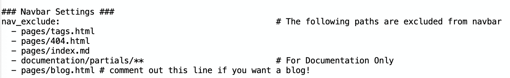

 
 
 

# TOPIC 1: Announcements & Reminders

---

## Groups for Final Projects -- due April 15!

* #find-a-final-project-group on Slack
* **Be aware:** there are parts of Final Project Part 3 that are still done individually!

---

## Final Project

There are three components, turned in the last three weeks of class.

You will have three general components:

1. Viz for Self (Due Apr 17 - individual)
1. Viz for Peers (Due Apr 25 - group)
1. Viz for Others (Due Apr 29 (for feedback), May 8 (final) - part group/part individual)

Be aware:
 * **NO** extensions for these assignments.
 * There is a group-submission option (sign up open, closes this week!).

note:
just some reminders about the final project

there are NO extensions available -- you can't use one of your HW extensions for these components

also, parts 2 & 3 will be in a group, however you will pick your own groups AND you can be in a group of 1 if you want 

**go to where groups are in student view on Canvas**

---

## Prof. Naiman gone this week

* we *will* have class -- two of our TA's (Lucian & Gaozheng) will have office hours in class
* videos for what we would cover are uploaded (see "Week 11 Page" under Canvas Module for this week)
* my Office Hours are canceled this week

---

## To turn on blogs on Jekyll

---

## Where things are stored for prep/in class

notes:
this will be a little different for Jekyll and streamlit stuffs!

**point out that there are now folders with files on the webpage**

---

## Homework 5 & 6 -- you have to do one!

See the syllabus for more details but basically:
* if you've done well on all other HW's, and do HW5 *or* HW6 -- we will drop the lowest
* if you choose *not* to do both HW5 and HW6, they will *both* count toward your final grade (i.e. you'll have 2 "0"s!), so make sure you do at least one of these assignments!

notes:

We will talk more about HW5 later in class!

**point this out!**