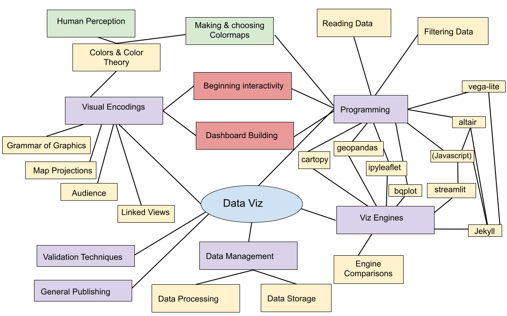
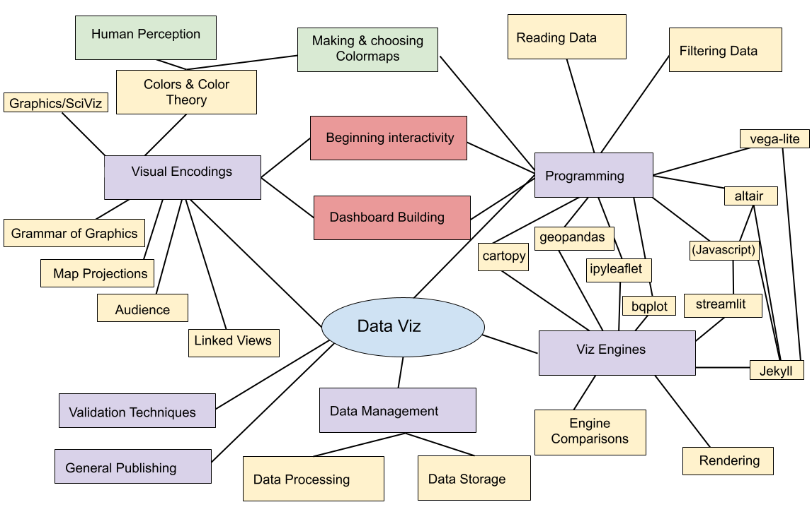

## Last Week

notes:
so far, we've been covering a bit of javascript and vega-lite as some new viz engines and using them in Jekyll and Streamlit

---

## This Week

notes:

today we'll discuss a bit about how rendering 3D objects to make them look "photo realistic" works, which will give us an intro to scientific viz ...

---

## Final Project Reminders

You will have three general components:

1. Viz for Self (Due Nov 21 - individual)
1. Viz for Peers (Due Dec 3 - group)
1. Viz for Others (Due Dec 10 (for feedback), Dec 18 (final) - part group/part individual)

Be aware:
 * **NO** extensions for these assignments.
 * There is a group-submission option.

---

## Final Project, Part 2 (after talk)

