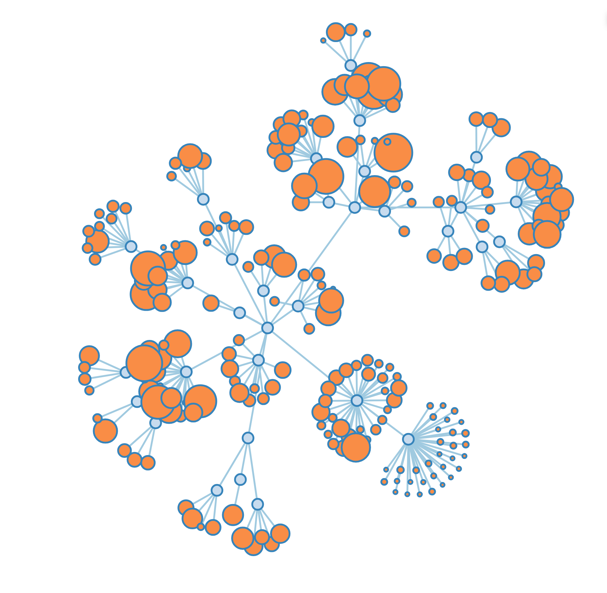
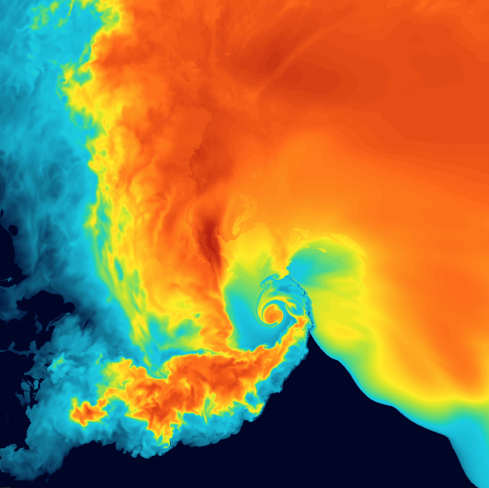
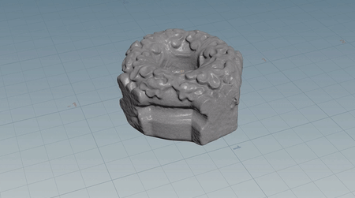
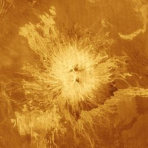
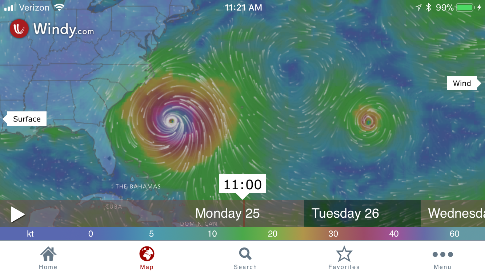
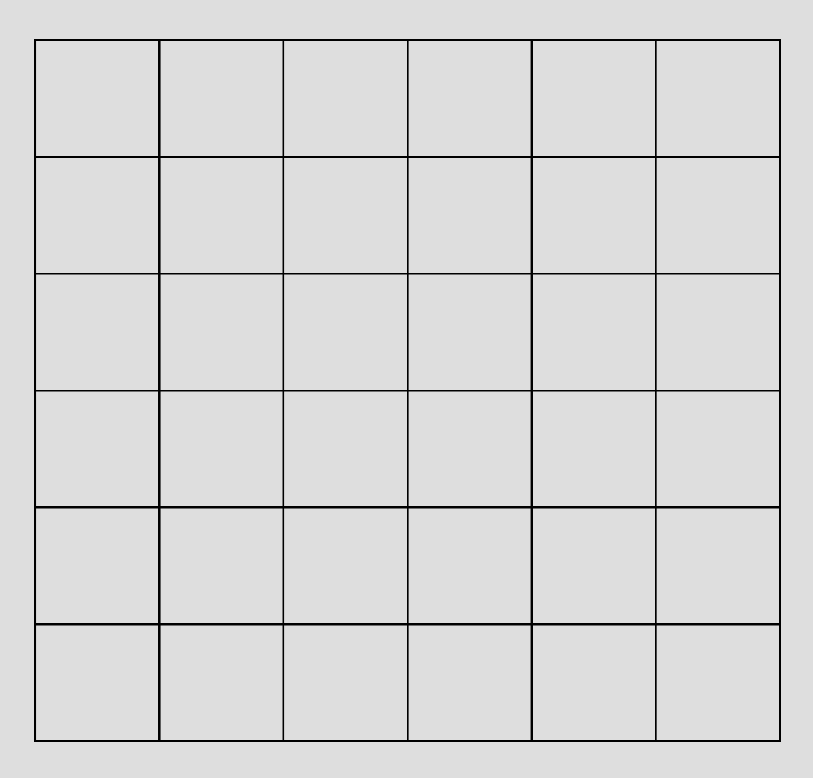
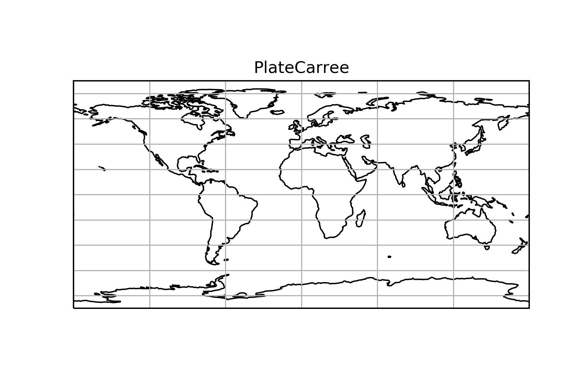
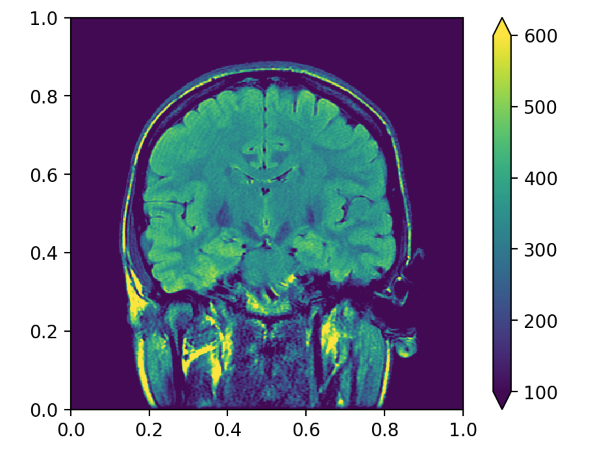
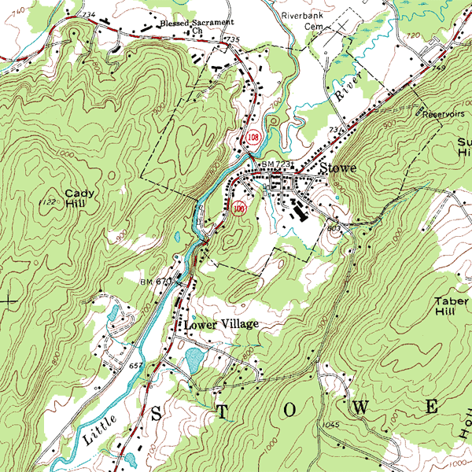
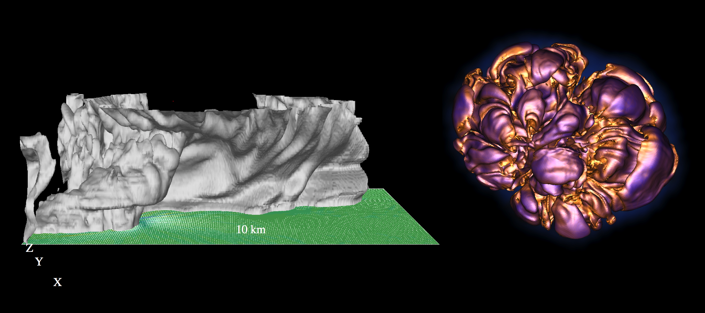

## Last Time/This Time

notes: 

Just as a reminder of all of the things we've covered up an until this point! Last time we covered a little bit about scientific visualization, and got/will get a guest lecture about more.  

This lecture covers scientific data viz, specifically things that will be covered for the extra credit assignment, and we'll get some practice with yt.  We probably won't get to everything that is in the prep notebooks, but they are there for your reference if interested!

---

## Information Visualization

So far: Spatial encoding is chosen by the designer

notes: so far, a lot of our placement of objects has been up to us

---

## Scientific Visualization

Sci Viz: Spatial encoding is provided in the data

notes: but with sci viz, we are usually dealing with spatial data - so we are told by the 
science where we should be placing things in 3D space

we did this sort of thing in 2D for data on maps, but this gives even more detail on 
where each data point should be placed

---

## Spatial Data

 1. Geometry
  * Volumetric Fields

note: there are different kinds of spatial datasets

Here is shown some volumetric data - i.e. you are given points of things in 3D space

shown here is a simulation in Houdini (a special effects software package) showing smoke rising

The left plot shows the simulation data points, the middle plot shows how they are interpolated to a surface and the right shows how they are "rendered" i.e. made into a movie using a smoke "shader" which dictates how light rays will travel through the object

---

## Spatial Data

 1. Geometry
   * Polygons

notes: another thing you will see a lot is 3-dimensional surfaces like the one shown here

Instead of specifying data at each point in the 3D volume, we are specifying the surface - i.e. an interconnected list of polygons that makes this shape

(we'll actually play with surfaces later in class and volumes either next week or the last week)

---

## Spatial Data

 1. Geometry
   * Polygons
   * Point Clouds

notes:

Sometimes you'll see data shown by points.  Before, we were showing data that "filled up" the space, but here point clouds are almost like infinitely small data points at specific locations in space

point clouds can be static, or they can have physics which make them a "particle system".

FYI this is a non-final render of some data from the "Solar Super Storms" movie that the AVL created

---

## Spatial Data

 2. Volumetric Fields

notes:
How do you represent something like this with data?

You need scalars to describe things like material.

You need vectors to describe things like motion (velocity). 

---

## Spatial Data

 2. Volumetric Fields
    * Scalar

notes:
This sequence reveals the underlying 3D grids of several scalar fields including:

H1 density

H2 density

photogamma

temperature

metallicity

Basically, you can think of the centers of each cubes specifying where the data points actually are - more densely packed cubes means *higher resolution* data

---

## Spatial Data

 2. Volumetric Fields
    * Scalar

notes:
Fields can be 2D or 3D. Images can be used as 2D data fields.

AVL used this image from the Magellan satellite to create a "displacement map" for this venusian volcano called "Sapas Mons".

2D fields can also be layered in formats common to GIS, or Hollywood formats like EXR.

---

## Spatial Data

 2. Volumetric Fields
    * Scalar
    * Vector

[Windy Weather Map](https://www.windy.com)

notes:
Windy is an interactive wind velocity map. It's always interesting to look at, but especially during hurricane season. I captured this image as Hurricane Maria flirted with the East coast in Sept 2017.

---

## Spatial Data

 2. Volumetric Fields
    * Scalar
    * Vector

Its even possible to do this in real time: [Earth map](https://earth.nullschool.net/)

---

## Spatial Data

 2. Volumetric Fields
    * Scalar
    * Vector

notes:
In this visualization we're seeing 3D velocity streamlines.

We're ALSO seeing a scalar volume called "vorticity" which is directly derived from the velocity field by taking a mathematical operation called the "curl".

In this case we are plotting *both* scalar (volume glow) and vector (streaming lines) data in the same viz!

Also from solar super storms

---

## Spatial Data

 2. Volumetric Fields
    * Uniform or non-uniform
    * Rectangular or non-rectangular

notes:
Adaptive mesh refinement is an especially efficient 3D storage for datatypes that have small areas of high detail.

This is why dealing with scientific data can be a little tricky - it can be hard to make surfaces or volumes out of irregularly gridded data

---

## Spatial Data Types

 1. Statistical
    * Star species
    * Atom prevalence
 1. Observational
    * Telescope images
    * Microscope images
    * LIDAR
 1. Simulated by computer models
    * First principles physics
    * Astronomy, geology, biology

---

## Visualizing Point Data

 * Dots with scale

notes: some other, less used data types include things like dots with scale

---

## Visualizing Point Data

 * Dots with scale
 * Sprites

notes:
All the moving dots in this video are represented by a gaussian splat image. You can see how they are adjusted to be different size and color (the important things are the purple ones)

FYI this is a little pre-final version of an upcoming movie called "Birth of Planet Earth"

---

## Visualizing Point Data

 * Dots with scale
 * Sprites

notes:
But gaussian blur isn't the only way to put a sprite on a point. This version used text instead. (purple q's instead of sprites)

---

## Visualizing Point Data

 * Dots with scale
 * Sprites
 * Meshing

notes:
This is a test AVL worked on with an SPH "smooth particle hydrodynamics" dataset where we created a surface across points. The surface was generated at a density threshold - aka, it was an infinitely thin shell shrinkwrapped onto all particles that were above a certain density.

This is a way to turn particles into surfaces or polygons.

We won't get to play as much with surfaces ourselves, BUT if you were able to install PyGEL3D there are some examples in the prep notebook

---

## Visualizing Polygons

 * Vector lines with width, can be filled

notes:
We're already familiar with this data from MAPS week.

---

## Visualizing Polygons

 * Vector lines with width, can be filled
 * Direct rendering of architectural schematics

notes:
Sometimes you will be given a description of geometric objects that you need to construct.

---

## Visualizing Polygons

 * Vector lines with width, can be filled
 * Direct rendering of architectural schematics
 * Direct rendering of 3D scans (pre-meshed)

notes:
Sometimes you will get something that was originally generated from a point cloud but has already been meshed. Domain experts sometimes have access to better meshing tools, particularly in the realm of 3D scanning.

---

## Visualizing Scalar Fields

 * Slice

notes:
Today we'll play with this brain scan data - this is only a single image slice out of a 3D gridded dataset.

Even if you're not showing your final visualization as a slice, this is a good step for understanding and troubleshooting. As we've mentioned before, reducing dimensionality makes things clearer to the human brain.

---

## Visualizing Scalar Fields

 * Slice
 * Isosurface

notes:
You have probably seen this type of topographic map where lines indicate elevation. These lines are called isocontours. You can combine isocontours to get isosurfaces.

---

## Visualizing Scalar Fields

 * Slice
 * Isosurface

notes:
This is an isosurface of a tornado-forming storm cloud, and another of a supernova that the scientist called "the walnut".

Isosurfaces can make analysis easier.

---

## Visualizing Scalar Fields

 * Slice
 * Isosurface
 * 3D Volumetric Rendering

notes:
But of course, you can always render the volume as a volume too. This is a volumetric tornado-forming storm cloud by Dave Bock who also works at the NCSA. 

While this looks similar to the volume rendering at the beginning of class its a better representation of reality - this includes a lot more physics, making it a scientific dataset.

---

## Visualizing Vector Fields

 * Arrow glyphs

notes:
vectors are often represented with arrows at specific points

I'm actually not sure what this is showing, but my guess is magnetic field lines, probably in some explosive astro event (like a super novae or something)

---

## Visualizing Vector Fields

 * Arrow glyphs
 * Streamlines / Streamtubes
    * Particle Advection!

notes:
But you can also show streamlines, which track vectors across the whole grid. Particle advection is releasing massless particles into a vector field, letting the vectors push them around, and tracing their progress.

This tornado visualization actually shows arrow on the ground AND streamlines in the air.

---

## yt

yt is an open-source, permissively-licensed python package for analyzing and visualizing volumetric data.

[yt-project.org](https://yt-project.org/)

There is a big yt community at the iSchool and NCSA!

